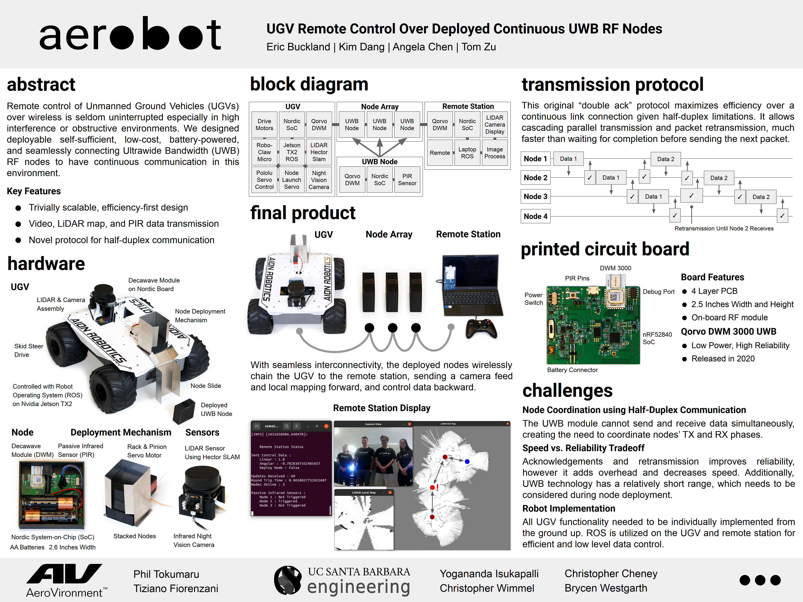
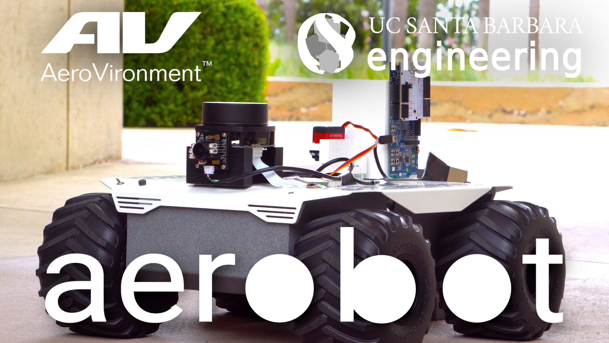

# aerobot Capstone Project
### UGV Remote Control Over Deployed Continuous UWB RF Nodes

- ***Won 2nd place ‘Capstone Best Project Award’***  
- ***Paper accepted at 2022 International Telemetering Conference***

## Sources

- [robot_ws - Capstone AION UGV ROS Catkin Workspace](https://github.com/eric334/robot_ws)

- [remote_ws - Capstone Remote Station ROS Catkin Workspace](https://github.com/eric334/remote_ws)

- [nrf_com_controller - Capstone NRF USB Serial and DWM Communication Source](https://github.com/eric334/nrf_com_controller)

## Poster

[Poster PDF](Poster.pdf)

## Paper

[Relay Connectivity in High Interference Environments Through Deployable Ultrawide Bandwidth Wireless Nodes](aerobot_ITC_2022.pdf)

## Video

